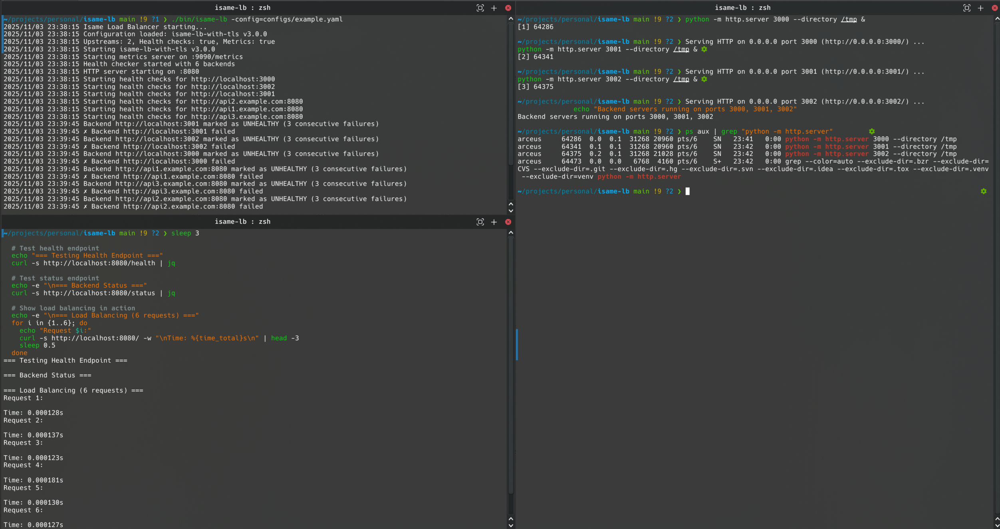
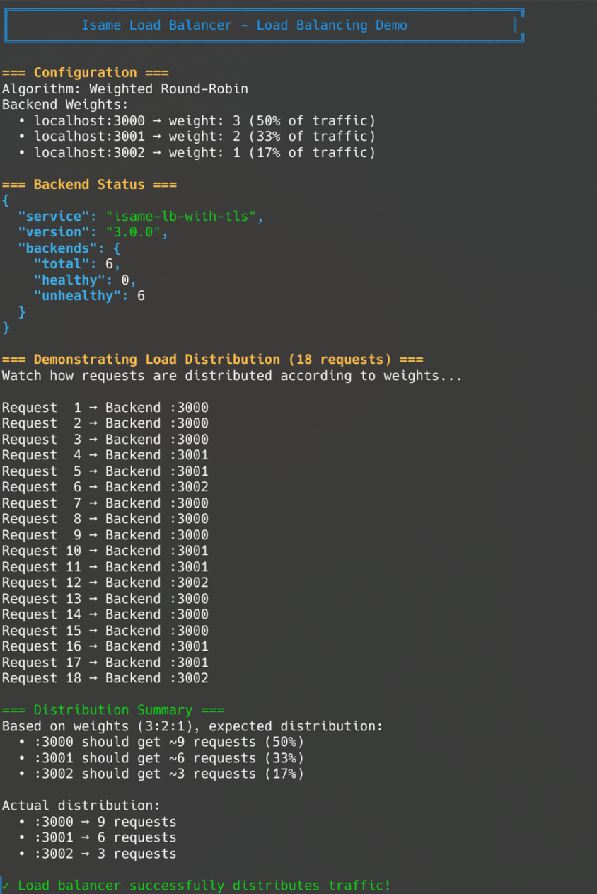

# Isame Load Balancer

A HTTP/HTTPS load balancer written in Go with TLS termination, multiple load balancing algorithms (RR, WRR, LC), circuit breaker, retry logic, rate limiting, health checking, Prometheus metrics.

## Features

- Contains Round robin, weighted RR, least connections
- Has TLS/SSL termination with configurable versions (1.2/1.3)
- Has a circuit breaker pattern and exponential backoff retry
- Per-client rate limiting with sliding window
- Active monitoring with configurable thresholds
- Contains prometheus metrics and status endpoints

## Prerequisites

- Go 1.22 or later
- Make (optional)

## Quick Start

```bash
# Build
make build

# Run with example config
./bin/isame-lb -config=configs/example.yaml

# Run with HTTPS enabled
cd certs/dev && ./generate.sh  # Generate certificates
cd ../..
./bin/isame-lb -config=configs/dev-tls.yaml
```

## Configuration Example

```yaml
version: "2.0.0"
service: "my-load-balancer"

server:
  port: 8080

upstreams:
  - name: "web-servers"
    algorithm: "weighted_round_robin" # round_robin, weighted_round_robin, least_connections
    backends:
      - url: "http://localhost:3000"
        weight: 3
      - url: "http://localhost:3001"
        weight: 2
    rate_limit:
      enabled: true
      requests_per_ip: 100
      window_size: "1m"

health:
  enabled: true
  interval: "30s"
  timeout: "5s"
  path: "/health"
  unhealthy_threshold: 3
  healthy_threshold: 2

metrics:
  enabled: true
  port: 9090
  path: "/metrics"

circuit_breaker:
  enabled: true
  failure_threshold: 5
  timeout: "60s"

retry:
  enabled: true
  max_attempts: 3
  initial_backoff: "100ms"
  max_backoff: "2s"

tls:
  enabled: true
  cert_file: "certs/dev/server.crt"
  key_file: "certs/dev/server.key"
  min_version: "1.2"
```

## API Endpoints

**Load Balancer (Port 8080/8443)**

- `GET /health` - Health check
- `GET /status` - Backend health status
- `/*` - Proxy to backend servers

**Metrics Server (Port 9090)**

- `GET /metrics` - Prometheus metrics

## Usage Examples

```bash
# Check health
curl http://localhost:8080/health

# Check HTTPS
curl -k https://localhost:8443/health

# View status
curl http://localhost:8080/status

# View metrics
curl http://localhost:9090/metrics
```

---

## Demo

### System Overview

Full system running with load balancer, backend servers, and monitoring:



### Load Balancing in Action

Weighted round-robin algorithm distributing traffic across backends (3:2:1 ratio):



---

## Development

```bash
# Run tests
make test

# Run linter
make lint

# Format code
make fmt
```

## License

See [LICENSE](LICENSE) file for details.
